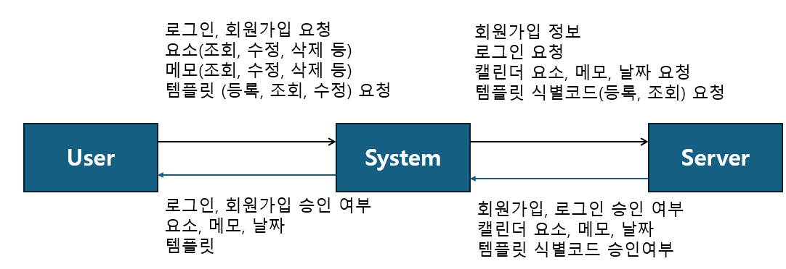

<h1 align="center">
  나만의 캘린더 
  -Conceptualization document-  
     
</h1>
<body style="font-size: 20px;">22412073, 이아림, forleer179@gmail.comm</body>

<h2 align="center">[ Revision history ]</h2>
<table>
  <tr>
    <th>Revision date</th>
    <th>Version #</th>
    <th>Description</th>
    <th>Author</th>
  </tr>
  <tr>
    <th>2026-03-26</th>
    <th>#0.1</th>
    <th>First Documentation</th>
    <th></th>
  </tr>
  <tr>
    <th></th>
    <th></th>
    <th></th>
    <th></th>
  </tr>
</table>

<h2 align="center">= Contents =</h2>
<h3>
  1. Business purpose 
  2. System context diagram 
  3. Use case list 
  4. Concept of operation 
  5. Problem statement 
  6. Glossary 
  7. References 
</h3>

<h2>1. Business Purpose</h2>
기본적으로 스마트폰, 컴퓨터, 태블릿 등 대부분의 기기에는 캘린더 기능이 탑재되어 있다. 그러나 기존 캘린더는 스티커나 간단한 메모 정도의 제한적인 꾸미기 기능만 제공한다. 이에 더 나아가 캘린더를 자유롭게 꾸미고, 이를 템플릿으로 제작하여 다른 사용자들과 공유할 수 있는 기능에 대한 필요성을 느끼게 되었다. 
플레이스토어 기준으로 다양한 캘린더 및 메모 앱이 존재하지만, 캘린더 자체를 꾸미고 이를 템플릿화하여 공유하는 기능을 중심으로 한 앱은 찾기 어려웠다. 한편, 배경화면이나 앱 아이콘 등을 꾸며 자신의 취향을 표현하는 사용자들은 이미 다수 존재하며, 특히 10대~20대의 젊은 사용자층에서 이러한 개인화 수요가 두드러진다. 
본 프로젝트는 이러한 젊은 타겟층을 주요 사용자로 설정하고, 디자인 자유도와 템플릿 공유 기능을 핵심 차별성으로 한다. 사용자는 캘린더의 배경과 날짜별 영역에 벡터 기반으로 자유롭게 그리거나 꾸밀 수 있으며, 다양한 스티커를 활용하여 자신만의 캘린더를 제작할 수 있다. 또한 완성된 캘린더를 템플릿 형태로 저장하고 다른 사용자들과 공유할 수 있도록 하여, 단순한 일정 관리 기능을 넘어 사용자 간 콘텐츠 교류가 가능한 플랫폼을 지향한다. 
이를 통해 사용자는 자신의 취향을 반영한 개인화된 일정 관리를 할 수 있으며, 다른 사용자들의 템플릿을 활용하여 새로운 스타일을 경험할 수 있다. 나아가 캘린더를 단순한 도구가 아닌 하나의 콘텐츠이자 표현 수단으로 확장시키는 효과를 기대할 수 있다. 
<h2>2. System context diagram</h2>
 

<h2>3. Use case list</h2>
1) Login
<table>
  <tr>
    <th>Actor</th>
    <th>User</th>
  </tr>
  <tr>
    <th>Description</th>
    <th>유저가 로그인한다.</th>
  </tr>
</table>
2) Register
<table>
  <tr>
    <th>Actor</th>
    <th>User</th>
  </tr>
  <tr>
    <th>Description</th>
    <th>사용자가 회원가입을 한다.</th>
  </tr>
</table>
3) view calender
<table>
  <tr>
    <th>Actor</th>
    <th>User</th>
  </tr>
  <tr>
    <th>Description</th>
    <th>유저가 캘린더를 조회한다.</th>
  </tr>
</table>
4) view memo
<table>
  <tr>
    <th>Actor</th>
    <th>User</th>
  </tr>
  <tr>
    <th>Description</th>
    <th>유저가 메모를 조회한다.</th>
  </tr>
</table>
5) upload memo
<table>
  <tr>
    <th>Actor</th>
    <th>User</th>
  </tr>
  <tr>
    <th>Description</th>
    <th>유저가 메모를 등록한다.</th>
  </tr>
</table>
6) modify memo
<table>
  <tr>
    <th>Actor</th>
    <th>User</th>
  </tr>
  <tr>
    <th>Description</th>
    <th>유저가 메모를 수정한다.</th>
  </tr>
</table>
7) delete memo
<table>
  <tr>
    <th>Actor</th>
    <th>User</th>
  </tr>
  <tr>
    <th>Description</th>
    <th>유저가 메모를 삭제한다.</th>
  </tr>
</table>
8) Design Encoding
<table>
  <tr>
    <th>Actor</th>
    <th>User</th>
  </tr>
  <tr>
    <th>Description</th>
    <th>유저가 캘린더 디자인을 코드화한다.</th>
  </tr>
</table>
9) Design Decoding
<table>
  <tr>
    <th>Actor</th>
    <th>User</th>
  </tr>
  <tr>
    <th>Description</th>
    <th>유저가 캘린더 디자인 코드를 불러온다.</th>
  </tr>
</table>

<h2>4. Concept of operation</h2>
1) Login
<table>
  <tr>
    <th>Purpose</th><th>앱을 사용하기 위해 등록된 사용자인지 확인</th>
  </tr>
  <tr>
    <th>Approach</th><th>사용자가 앱을 실행 후 로그인 시 ID, PW를 입력 후 로그인을 요청하면 서버에서 회원 정보를 조회 후 로그인 성공/실패 여부 확인한다.</th>
  </tr>
  <tr>
    <th>Dynamics</th><th>앱 실행 시 로그인 할 경우</th>
  </tr>
  <tr>
    <th>Goals</th><th>로그인 기능을 구현한다</th>
  </tr>
</table>
2) Register
<table>
  <tr>
    <th>Purpose</th><th>앱을 사용하기 위한 사용자 등록</th>
  </tr>
  <tr>
    <th>Approach</th><th>사용자에게 필요한 정보들을 입력받고 중복되는 ID가 없는지 확인 후 서버에 저장한다</th>
  </tr>
  <tr>
    <th>Dynamics</th><th>로그인을 하기 위해 회원가입을 하는 경우</th>
  </tr>
  <tr>
    <th>Goals</th><th>회원가입 기능을 구현한다</th>
  </tr>
</table>
3) view calender
<table>
  <tr>
    <th>Purpose</th><th>자신의 캘린더 및 메모 조회</th>
  </tr>
  <tr>
    <th>Approach</th><th>사용자가 자신의 캘린더를 확인하고 메모들을 볼 수 있다</th>
  </tr>
  <tr>
    <th>Dynamics</th><th>사용자가 자신의 캘린더를 확인하는 경우</th>
  </tr>
  <tr>
    <th>Goals</th><th>자신의 캘린더를 확인할 수 있도록 한다</th>
  </tr>
</table>
4) view memo
<table>
  <tr>
    <th>Purpose</th><th>자신의 메모 상세 조회</th>
  </tr>
  <tr>
    <th>Approach</th><th>사용자가 자신의 메모를 상세히 확인하고 볼 수 있다</th>
  </tr>
  <tr>
    <th>Dynamics</th><th>사용자가 자신의 메모를 확인하는 경우</th>
  </tr>
  <tr>
    <th>Goals</th><th>자신의 메모를 상세 확인할 수 있도록 한다</th>
  </tr>
</table>
5) upload memo
<table>
  <tr>
    <th>Purpose</th><th>자신의 메모 등록</th>
  </tr>
  <tr>
    <th>Approach</th><th>사용자가 서버에 메모를 등록한다</th>
  </tr>
  <tr>
    <th>Dynamics</th><th>사용자가 서버에 메모를 등록할 때</th>
  </tr>
  <tr>
    <th>Goals</th><th>사용자가 메모를 등록할 수 있도록 한다</th>
  </tr>
</table>
6) modify memo
<table>
  <tr>
    <th>Purpose</th><th>등록한 메모를 수정</th>
  </tr>
  <tr>
    <th>Approach</th><th>사용자가 등록한 메모를 수정한다</th>
  </tr>
  <tr>
    <th>Dynamics</th><th>사용자가 메모 수정할 때</th>
  </tr>
  <tr>
    <th>Goals</th><th>사용자가 메모를 수정할 수 있도록 한다</th>
  </tr>
</table>
7) delete memo
<table>
  <tr>
    <th>Purpose</th><th>등록한 메모를 삭제</th>
  </tr>
  <tr>
    <th>Approach</th><th>사용자가 등록한 메모를 서버에서 삭제한다</th>
  </tr>
  <tr>
    <th>Dynamics</th><th>사용자가 메모 삭제할 때 또는 날짜가 지나고 기간이 오래됐을때</th>
  </tr>
  <tr>
    <th>Goals</th><th>사용자가 메모를 삭제할 수 있도록 한다</th>
  </tr>
</table>
8) Design Encoding
<table>
  <tr>
    <th>Purpose</th><th>사용자가 디자인한 캘린더 템플릿화</th>
  </tr>
  <tr>
    <th>Approach</th><th>사용자가 디자인한 캘린더를 인코딩하여 서버에 등록한다</th>
  </tr>
  <tr>
    <th>Dynamics</th><th>사용자가 캘린더를 템플릿화하고 싶을 때</th>
  </tr>
  <tr>
    <th>Goals</th><th>사용자가 캘린더 디자인을 템플릿화할 수 있도록 한다</th>
  </tr>
</table>
9) Design Decoding
<table>
  <tr>
    <th>Purpose</th><th>사용자가 템플릿을 불러올 수 있도록 한다</th>
  </tr>
  <tr>
    <th>Approach</th><th>사용자가 코드를 입력하여 템플릿을 불러온다</th>
  </tr>
  <tr>
    <th>Dynamics</th><th>사용자가 템플릿을 불러오고 싶을 때</th>
  </tr>
  <tr>
    <th>Goals</th><th>코드를 입력할 경우 등록된 디자인을 불러올 수 있도록 한다</th>
  </tr>
</table>

<h2>5. Problem Statement</h2>
<strong>Problem #1</strong> 
프로젝트에 있어 기획, 제작 등의 능력 부족. 프로젝트 제작에 미숙하여 개발기간의 장기화, 기간 부족 등 여러 문제를 겪을 수 있다.  
<strong>Problem #2</strong> 
용량 부족 문제. 벡터, 이모지, 이미지 등등 여러 요소들을 한 번에 등록, 불러오기 등을 실행할 경우 프로그램에 버벅임이나 오류 등을 초래할 수 있다.  
<strong>problem #3</strong> 
정보 침해 문제. 유저의 정보를 전산화 하여 서버에 등록할 경우 정보 침해 문제가 발생할 수 있다. 특히 개인 일정과 같이 개인 정보 침해 관련 문제가 커질 수 있다. 

<h2>6. Glossary</h2>
<table>
  <tr>
    <th>Terms</th>
    <th>Description</th>
  </tr>
  <tr>
    <th>유저</th>
    <th>캘린더를 조회, 수정, 삭제 등을 요청하는 사용자</th>
  </tr>
  <tr>
    <th>캘린더</th>
    <th>날짜, 요일, 절기, 공휴일 등 시간의 흐름을 기록하는 도구</th>
  </tr>
  <tr>
    <th>메모</th>
    <th>특정 날짜에 부가적으로 연결되는 사용자 입력 텍스트 데이터</th>
  </tr>
  <tr>
    <th>템플릿</th>
    <th>캘린더의 디자인과 구성 요소를 미리 정의한 재사용 가능한 구조 데이터</th>
  </tr>
  <tr>
    <th>디자인</th>
    <th>텍스트, 이모지, 이미지, 벡터 등 시각 요소와 그 배치 및 스타일</th>
  </tr>
</table>

<h2>7. References</h2>
<strong>1) title</strong> 
(1) 그림 1: 캘린더  
<strong>2) 1. Business Purpose</strong> 
(1) 참고: Google Play Store
