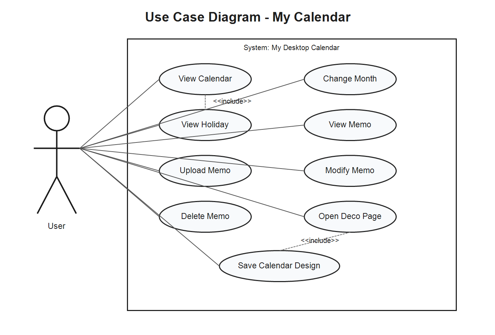

<h1 align="center">
  나만의 캘린더 
  -Conceptualization document-  
     
</h1>
<body style="font-size: 20px;">22412073, 이아림, forleer179@gmail.comm</body>

<h2 align="center">[ Revision history ]</h2>
<table>
  <tr>
    <th>Revision date</th>
    <th>Version #</th>
    <th>Description</th>
    <th>Author</th>
  </tr>
  <tr>
    <th>2026-03-26</th>
    <th>#0.1</th>
    <th>First Documentation</th>
    <th></th>
  </tr>
  <tr>
    <th>2026-05-26</th>
    <th>#0.2</th>
    <th>Update contents based on implemented calendar files</th>
    <th></th>
  </tr>
</table>

<h2 align="center">= Contents =</h2>
<h3>
  1. Business purpose 
  2. System context diagram 
  3. Use case list 
  4. Concept of operation 
  5. Problem statement 
  6. Glossary 
  7. References 
</h3>

<h2>1. Business Purpose</h2>
기본적으로 스마트폰, 컴퓨터, 태블릿 등 대부분의 기기에는 캘린더 기능이 탑재되어 있다. 그러나 기존 캘린더는 날짜를 확인하거나 일정을 적는 기능이 중심이기 때문에, 사용자가 자신의 취향에 맞게 화면을 꾸미는 기능은 제한적인 경우가 많다. 이에 따라 본 프로젝트는 사용자가 직접 캘린더의 색상, 폰트, 배경, 날짜 칸 스타일을 조절하고 날짜별 메모를 남길 수 있는 개인화 캘린더를 제작하는 것을 목적으로 한다. 
현재 구현된 나만의 캘린더는 웹 기반으로 동작하며, index.html에서 월별 캘린더를 보여주고 renderer.js를 통해 날짜 계산, 공휴일 표시, 메모 저장과 삭제를 처리한다. 사용자는 이전 달과 다음 달로 이동할 수 있고, 특정 날짜를 클릭하여 메모 모달을 열 수 있다. 작성한 메모는 브라우저 localStorage에 저장되어 같은 환경에서 다시 확인할 수 있다. 
또한 decorate.html과 decorate.js를 통해 별도의 캘린더 꾸미기 화면을 제공한다. 사용자는 미리보기 캘린더를 보면서 폰트 종류, 폰트 크기, 평일/토요일/일요일 및 공휴일 글자 색상, 전체 배경, 기본 날짜 칸, 이전 달/다음 달 칸, 하이라이트 표시 등을 수정할 수 있다. 수정한 값은 저장 버튼을 통해 localStorage에 보관되며, 다시 꾸미기 화면을 열었을 때 이전 설정을 불러올 수 있다. 
본 프로젝트는 단순히 날짜를 확인하는 캘린더가 아니라 사용자가 직접 꾸미고 기록하는 개인용 캘린더를 지향한다. 이를 통해 사용자는 일정 관리와 개인 취향 표현을 같은 화면에서 수행할 수 있으며, 캘린더를 더 자주 사용하고 싶은 개인화 도구로 활용할 수 있다. 
<h2>2. System context diagram</h2>
 

<h2>3. Use case list</h2>
1) View Calendar
<table>
  <tr>
    <th>Actor</th>
    <th>User</th>
  </tr>
  <tr>
    <th>Description</th>
    <th>유저가 월별 캘린더를 조회한다.</th>
  </tr>
</table>
2) Change Month
<table>
  <tr>
    <th>Actor</th>
    <th>User</th>
  </tr>
  <tr>
    <th>Description</th>
    <th>사용자가 이전 달 또는 다음 달 캘린더로 이동한다.</th>
  </tr>
</table>
3) View Holiday
<table>
  <tr>
    <th>Actor</th>
    <th>User</th>
  </tr>
  <tr>
    <th>Description</th>
    <th>유저가 캘린더에서 공휴일 정보를 확인한다.</th>
  </tr>
</table>
4) view memo
<table>
  <tr>
    <th>Actor</th>
    <th>User</th>
  </tr>
  <tr>
    <th>Description</th>
    <th>유저가 특정 날짜의 메모를 조회한다.</th>
  </tr>
</table>
5) upload memo
<table>
  <tr>
    <th>Actor</th>
    <th>User</th>
  </tr>
  <tr>
    <th>Description</th>
    <th>유저가 특정 날짜에 메모를 등록한다.</th>
  </tr>
</table>
6) modify memo
<table>
  <tr>
    <th>Actor</th>
    <th>User</th>
  </tr>
  <tr>
    <th>Description</th>
    <th>유저가 저장된 메모 내용을 수정한다.</th>
  </tr>
</table>
7) delete memo
<table>
  <tr>
    <th>Actor</th>
    <th>User</th>
  </tr>
  <tr>
    <th>Description</th>
    <th>유저가 저장된 메모를 삭제한다.</th>
  </tr>
</table>
8) Open Deco Page
<table>
  <tr>
    <th>Actor</th>
    <th>User</th>
  </tr>
  <tr>
    <th>Description</th>
    <th>유저가 사이드 메뉴를 통해 캘린더 꾸미기 화면으로 이동한다.</th>
  </tr>
</table>
9) Save Calendar Design
<table>
  <tr>
    <th>Actor</th>
    <th>User</th>
  </tr>
  <tr>
    <th>Description</th>
    <th>유저가 캘린더 디자인 설정을 저장한다.</th>
  </tr>
</table>

<h2>4. Concept of operation</h2>
1) View Calendar
<table>
  <tr>
    <th>Purpose</th><th>사용자가 현재 월의 캘린더를 확인</th>
  </tr>
  <tr>
    <th>Approach</th><th>사용자가 index.html을 실행하면 renderer.js가 현재 날짜를 기준으로 캘린더를 생성하고 화면에 출력한다.</th>
  </tr>
  <tr>
    <th>Dynamics</th><th>앱을 처음 실행하거나 캘린더 화면으로 돌아온 경우</th>
  </tr>
  <tr>
    <th>Goals</th><th>월별 날짜와 요일을 한눈에 확인할 수 있도록 한다</th>
  </tr>
</table>
2) Change Month
<table>
  <tr>
    <th>Purpose</th><th>이전 달 또는 다음 달 캘린더 조회</th>
  </tr>
  <tr>
    <th>Approach</th><th>사용자가 좌우 이동 버튼을 클릭하면 date 값을 변경하고 캘린더를 다시 생성한다.</th>
  </tr>
  <tr>
    <th>Dynamics</th><th>사용자가 다른 월의 날짜와 메모를 확인하고 싶은 경우</th>
  </tr>
  <tr>
    <th>Goals</th><th>사용자가 원하는 월로 자유롭게 이동할 수 있도록 한다</th>
  </tr>
</table>
3) View Holiday
<table>
  <tr>
    <th>Purpose</th><th>캘린더에서 공휴일 정보 확인</th>
  </tr>
  <tr>
    <th>Approach</th><th>공공데이터포털 공휴일 API를 호출하여 해당 연도의 공휴일을 가져오고 날짜 칸에 공휴일명을 표시한다.</th>
  </tr>
  <tr>
    <th>Dynamics</th><th>캘린더가 생성되거나 월이 변경되는 경우</th>
  </tr>
  <tr>
    <th>Goals</th><th>일요일과 공휴일을 구분하여 사용자가 중요한 날짜를 쉽게 확인할 수 있도록 한다</th>
  </tr>
</table>
4) view memo
<table>
  <tr>
    <th>Purpose</th><th>특정 날짜의 메모 상세 조회</th>
  </tr>
  <tr>
    <th>Approach</th><th>사용자가 날짜 칸을 클릭하면 메모 모달을 열고 localStorage에 저장된 해당 날짜의 메모를 불러온다.</th>
  </tr>
  <tr>
    <th>Dynamics</th><th>사용자가 특정 날짜의 기록을 확인하는 경우</th>
  </tr>
  <tr>
    <th>Goals</th><th>날짜별 메모를 상세 확인할 수 있도록 한다</th>
  </tr>
</table>
5) upload memo
<table>
  <tr>
    <th>Purpose</th><th>특정 날짜에 새 메모 등록</th>
  </tr>
  <tr>
    <th>Approach</th><th>사용자가 메모 모달의 입력창에 내용을 입력하고 저장 버튼을 누르면 calendarMemos 값으로 localStorage에 저장한다.</th>
  </tr>
  <tr>
    <th>Dynamics</th><th>사용자가 날짜별 기록을 새로 남기고 싶은 경우</th>
  </tr>
  <tr>
    <th>Goals</th><th>사용자가 날짜별 메모를 등록할 수 있도록 한다</th>
  </tr>
</table>
6) modify memo
<table>
  <tr>
    <th>Purpose</th><th>등록한 메모를 수정</th>
  </tr>
  <tr>
    <th>Approach</th><th>사용자가 기존 메모가 있는 날짜를 클릭한 뒤 내용을 고치고 저장하면 해당 날짜의 localStorage 값이 갱신된다.</th>
  </tr>
  <tr>
    <th>Dynamics</th><th>사용자가 기존 메모 내용을 바꾸고 싶은 경우</th>
  </tr>
  <tr>
    <th>Goals</th><th>사용자가 메모를 수정할 수 있도록 한다</th>
  </tr>
</table>
7) delete memo
<table>
  <tr>
    <th>Purpose</th><th>등록한 메모를 삭제</th>
  </tr>
  <tr>
    <th>Approach</th><th>사용자가 메모 모달에서 삭제 버튼을 누르면 해당 날짜의 메모 데이터를 localStorage에서 제거한다.</th>
  </tr>
  <tr>
    <th>Dynamics</th><th>사용자가 더 이상 필요하지 않은 메모를 지우고 싶은 경우</th>
  </tr>
  <tr>
    <th>Goals</th><th>사용자가 메모를 삭제할 수 있도록 한다</th>
  </tr>
</table>
8) Open Deco Page
<table>
  <tr>
    <th>Purpose</th><th>캘린더 꾸미기 화면으로 이동</th>
  </tr>
  <tr>
    <th>Approach</th><th>사용자가 옵션 아이콘을 클릭하면 사이드 메뉴가 열리고, 캘린더 꾸미기 항목을 누르면 decorate.html로 이동한다.</th>
  </tr>
  <tr>
    <th>Dynamics</th><th>사용자가 캘린더 디자인을 변경하고 싶은 경우</th>
  </tr>
  <tr>
    <th>Goals</th><th>사용자가 꾸미기 기능에 쉽게 접근할 수 있도록 한다</th>
  </tr>
</table>
9) Save Calendar Design
<table>
  <tr>
    <th>Purpose</th><th>사용자가 설정한 캘린더 디자인 저장</th>
  </tr>
  <tr>
    <th>Approach</th><th>사용자가 폰트, 글자 색상, 배경 색상, 날짜 칸 색상과 투명도를 변경한 뒤 저장 버튼을 누르면 decoFont, decoBg 등의 값으로 localStorage에 저장한다.</th>
  </tr>
  <tr>
    <th>Dynamics</th><th>사용자가 자신이 꾸민 캘린더 설정을 다시 사용하고 싶은 경우</th>
  </tr>
  <tr>
    <th>Goals</th><th>캘린더 디자인 설정을 저장하고 다시 불러올 수 있도록 한다</th>
  </tr>
</table>

<h2>5. Problem Statement</h2>
<strong>Problem #1</strong> 
프로젝트에 있어 기획, 제작 등의 능력 부족. 프로젝트 제작에 미숙하여 개발기간의 장기화, 기간 부족 등 여러 문제를 겪을 수 있다.  
<strong>Problem #2</strong> 
공휴일 API 호출 문제. 외부 API를 이용하여 공휴일 정보를 가져오기 때문에 네트워크 상태나 API 응답 문제에 따라 공휴일 표시가 누락될 수 있다.  
<strong>problem #3</strong> 
로컬 저장소 데이터 관리 문제. 메모와 꾸미기 설정을 localStorage에 저장하므로 같은 브라우저 환경에서는 편리하지만, 브라우저 데이터가 삭제되거나 다른 기기에서 접속할 경우 기존 정보를 불러오지 못할 수 있다. 

<h2>6. Glossary</h2>
<table>
  <tr>
    <th>Terms</th>
    <th>Description</th>
  </tr>
  <tr>
    <th>유저</th>
    <th>캘린더를 조회하고 메모와 꾸미기 기능을 사용하는 사용자</th>
  </tr>
  <tr>
    <th>캘린더</th>
    <th>날짜, 요일, 오늘 날짜, 공휴일, 메모 미리보기를 표시하는 화면</th>
  </tr>
  <tr>
    <th>메모</th>
    <th>특정 날짜에 연결되어 localStorage에 저장되는 사용자 입력 텍스트 데이터</th>
  </tr>
  <tr>
    <th>꾸미기 설정</th>
    <th>캘린더의 폰트, 글자 색상, 배경 색상, 날짜 칸 색상과 투명도 정보</th>
  </tr>
  <tr>
    <th>공휴일 API</th>
    <th>공공데이터포털에서 연도별 공휴일 정보를 가져오기 위한 외부 API</th>
  </tr>
</table>

<h2>7. References</h2>
<strong>1) title</strong> 
(1) 그림 1: 캘린더  
<strong>2) 1. Business Purpose</strong> 
(1) 참고: C:\2026_1\pretyCalendar\index.html 
(2) 참고: C:\2026_1\pretyCalendar\renderer.js 
(3) 참고: C:\2026_1\pretyCalendar\decorate.html 
(4) 참고: C:\2026_1\pretyCalendar\decorate.js 
