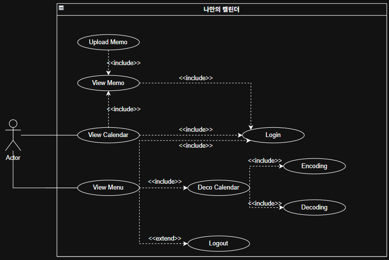

<h1 align="center">
  나만의 캘린더 
  -Analysis document-  
     
</h1>
<body style="font-size: 20px;">22412073, 이아림, forleer179@gmail.comm</body>

<h2 align="center">[ Revision history ]</h2>

<table>
  <tr>
    <th>Revision date</th>
    <th>Version #</th>
    <th>Description</th>
    <th>Author</th>
  </tr>
  <tr>
    <th>2026-05-01</th>
    <th>#0.1</th>
    <th>First Documentation</th>
    <th></th>
  </tr>
  <tr>
    <th></th>
    <th></th>
    <th></th>
    <th></th>
  </tr>
</table>

<h2 align="center">= Contents =</h2>
<h3>
  1. Introduction 
  2. Use case analysis 
  2.1 Use case diagram 
  2.2 Use case description 
  3. Domain analysis 
  4. Application analysis 
  4.1 Application analysis 
  4.2 Communication diagram 
  5. User Interface prototype 
  6. Glossary 
  7. References 
</h3>

<h2>1. Introduction</h2>
캘린더를 꾸미고 바탕화면이나 이미지 등으로 만드는 어플이 본 프로젝트를 통해 만들고자하는 소프트웨어이며 지난 개념화 문서에서 이 시스템의 요구사항들을 다뤘다. 이번 보고서는 시스템 요구사항들을 '시스템이 무엇을 하는가'에 맞춰서 use case, domain, aplication 분석을 진행하고 preliminary use manual과 사용자 인터페이스를 소개한다. 각각의 장에서 UML을 이용한 자세한 분석 결과와 그렇게 한 의도를 함께 기술했다. 보고서를 다 읽고 나면 만들고자 하는 시스템의 기능이 어떤 것이고 무슨 일을 하는지 모두 이해할 수 있을 것이다.
<h2>2. Use case analysis</h2>
<h3>2.1 Use case diagram</h3>
 
<h3>2.2 Use case description</h3>
<table>
  <tr>
    <th colspan="2">Use case #1: Log in</th>
  </tr>
  <tr>
    <th colspan="2">GENERAL CHARACTERISTICS</th>
  </tr>
  <tr>
    <th>Summary</th>
    <td>사용자 모두가 시스템의 특정 기능들을 사용하기 위해 회원 인증을 받을 때 사용하는 기능</td>
  </tr>
  <tr>
    <th>Scope</th>
    <td>캘린더 꾸미기</td>
  </tr>
  <tr>
    <th>Level</th>
    <td>User level</td>
  </tr>
  <tr>
    <th>Author</th>
    <td></td>
  </tr>
  <tr>
    <th>Last Update</th>
    <td></td>
  </tr>
  <tr>
    <th>Status</th>
    <td>Analysis</td>
  </tr>
  <tr>
    <th>Primary Actor</th>
    <td>User</td>
  </tr>
  <tr>
    <th>Preconditions</th>
    <td>사용자는 회원가입이 되어있어야 한다. 통신이 가능해야 한다.</td>
  </tr>
  <tr>
    <th>Trigger</th>
    <td>로그인 페이지에서 아이디와 비밀번호를 입력한 후 회원 인증을 받으려고 할 때</td>
  </tr>
  <tr>
    <th>Success Post Condition</th>
    <td>사용자는 로그인에 성공하여 시스템의 모든 기능을 사용할 수 있다</td>
  </tr>
  <tr>
    <th>Failed Post Condition</th>
    <td>사용자는 로그인에 실패하여 시스템의 특정한 기능을 사용핮 못 한다.</td>
  </tr>
  <tr>
    <th colspan="2">MAIN SUCCESS SCENARIO</th>
  </tr>
  <tr>
    <th>Step</th>
    <td>Action</td>
  </tr>
  <tr>
    <th>1</th> <td>이 Use case는 회원이 시스템에 로그인할 때 시작된다.</td>
  </tr>
  <tr>
    <th>2</th> <td>회원은 로그인 페이지에서 아이디와 비밀번호를 입력한 후 로그인 버튼을 누른다.</td>
  </tr>
  <tr>
    <th>3</th> <td>시스템은 데이터베이스에 있는 회원 정보를 체크하여 로그인 성공 유무를 판단핟ㄴ다. 등록된 회원이라면 로그인에 성공하고 캘린더 페이지를 띄운다.</td>
  </tr>
  <tr>
    <th>4</th> <td>이 use case는 로그인이 성공하면 끝난다.</td>
  </tr>
  <tr>
    <th colspan="2">EXTENSION SCENARIO</th>
  </tr>
  <tr>
    <th>Step</th> <td>Branching Action</td>
  </tr>
  <tr>
    <th>3</th> <td>3a. 등록되지 않은 회원이거나 통신에 문제가 있으면 로그인에 실패한다. 3a1. 로그인 실패 메시지를 띄운다. 3a2. 아이디 입력 단계로 돌아간다.</td>
  </tr>
  <tr>
    <th colspan="2">RELATED INFORMATION</th>
  </tr>
  <tr>
    <th>Performance</th> <td>< 1 second</td>
  </tr>
  <tr>
    <th>Frequency</th> <td>사용자당 하루 평균 2번</td>
  </tr>
  <tr>
    <th>Concurrency</th> <td>No Limits</td>
  </tr>
  <th>Due Date</th> <td></td>
</table>

<table>
  <tr>
    <th colspan="2">Use case #2: Log out</th>
  </tr>
  <tr>
    <th colspan="2">GENERAL CHARACTERISTICS</th>
  </tr>
  <tr>
    <th>Summary</th> <td>로그아웃할 때 쓰는 기능</td>
  </tr>
  <tr>
    <th>Scope</th> <td>캘린더 꾸미기</td>
  </tr>
  <tr>
    <th>Level</th> <td>User level</td>
  </tr>
  <tr>
    <th>Author</th> <td></td>
  </tr>
  <tr>
    <th>Last Update</th> <td></td>
  </tr>
  <tr>
    <th>Status</th> <td>Analysis</td>
  </tr>
  <tr>
    <th>Primary Actor</th> <td>User</td>
  </tr>
  <tr>
    <th>Preconditions</th> <td>사용자는 로그인이 되어있어야 한다. 통신이 가능해야 한다.</td>
  </tr>
  <tr>
    <th>Trigger</th> <td>이미 로그인된 상태에서 로그인 페이지를 눌렀을 때</td>
  </tr>
  <tr>
    <th>Success Post Condition</th> <td>사용자는 로그아웃에 성공한다</td>
  </tr>
  <tr>
    <th>Failed Post Condition</th> <td>사용자는 로그아웃에 실패한다</td>
  </tr>
  <tr>
    <th colspan="2">MAIN SUCCESS SCENARIO</th>
  </tr>
  <tr>
    <th>Step</th> <td>Action</td>
  </tr>
  <tr>
    <th>1</th> <td>이 Use case는 회원이 시스템에 로그인된 상태에서 로그아웃을 눌렀을 때 시작된다.</td>
  </tr>
  <tr>
    <th>2</th> <td>회원은 로그인 페이지에서 로그아웃 버튼을 누른다.</td>
  </tr>
  <tr>
    <th>3</th> <td>시스템은 로그아웃이 성공한지 판단한다.</td>
  </tr>
  <tr>
    <th>4</th> <td>이 use case는 로그아웃이 성공하면 끝난다.</td>
  </tr>
  <tr>
    <th colspan="2">EXTENSION SCENARIO</th>
  </tr>
  <tr>
    <th>Step</th> <td>Branching Action</td>
  </tr>
  <tr>
    <th>3</th> <td>3a. 통신에 문제가 있으면 로그아웃에 실패한다. 3a1. 로그아웃 실패 메시지를 띄운다. 3a2. 로그아웃 페이지로 돌아간다.</td>
  </tr>
  <tr>
    <th colspan="2">RELATED INFORMATION</th>
  </tr>
  <tr>
    <th>Performance</th> <td>< 1 second</td>
  </tr>
  <tr>
    <th>Frequency</th> <td>사용자당 하루 평균 1번</td>
  </tr>
  <tr>
    <th>Concurrency</th> <td>No Limits</td>
  </tr>
  <th>Due Date</th> <td></td>
</table>

<table>
  <tr>
    <th colspan="2">Use case #3: View Calendar</th>
  </tr>
  <tr>
    <th colspan="2">GENERAL CHARACTERISTICS</th>
  </tr>
  <tr>
    <th>Summary</th> <td>사용자가 캘린더를 보고 싶을 때 사용하는 기능</td>
  </tr>
  <tr>
    <th>Scope</th> <td>캘린더 꾸미기</td>
  </tr>
  <tr>
    <th>Level</th> <td>User level</td>
  </tr>
  <tr>
    <th>Author</th> <td></td>
  </tr>
  <tr>
    <th>Last Update</th> <td></td>
  </tr>
  <tr>
    <th>Status</th> <td>Analysis</td>
  </tr>
  <tr>
    <th>Primary Actor</th> <td>User</td>
  </tr>
  <tr>
    <th>Preconditions</th> <td>어플이 설치되어 있어야 한다</td>
  </tr>
  <tr>
    <th>Trigger</th> <td>사용자가 캘린더를 보고 싶을 때</td>
  </tr>
  <tr>
    <th>Success Post Condition</th> <td>캘린더가 나온다.</td>
  </tr>
  <tr>
    <th>Failed Post Condition</th> <td>캘린더를 볼 수 없다.</td>
  </tr>
  <tr>
    <th colspan="2">MAIN SUCCESS SCENARIO</th>
  </tr>
  <tr>
    <th>Step</th> <td>Action</td>
  </tr>
  <tr>
    <th>1</th> <td>이 Use case는 사용자가 캘린더를 보고 싶을 때 시작한다.</td>
  </tr>
  <tr>
    <th>2</th> <td>사용자는 캘린더 보기 버튼을 누른다.</td>
  </tr>
  <tr>
    <th>3</th> <td>시스템은 캘린더를 불러온다.</td>
  </tr>
  <tr>
    <th>4</th> <td>이 use case는 캘린더 불러오기에 성공하면 끝난다.</td>
  </tr>
  <tr>
    <th colspan="2">EXTENSION SCENARIO</th>
  </tr>
  <tr>
    <th>Step</th> <td>Branching Action</td>
  </tr>
  <tr>
    <th>3</th> <td>3a. 시스템은 캘린더 불러오는데 실패한다. 3a1. 실패 메시지를 띄운다. 3a2. 마지막으로 본 페이지로 돌아간다.</td>
  </tr>
  <tr>
    <th colspan="2">RELATED INFORMATION</th>
  </tr>
  <tr>
    <th>Performance</th> <td>< 1 second</td>
  </tr>
  <tr>
    <th>Frequency</th> <td>사용자당 하루 평균 1번</td>
  </tr>
  <tr>
    <th>Concurrency</th> <td>No Limits</td>
  </tr>
  <th>Due Date</th> <td></td>
</table>

<table>
  <tr>
    <th colspan="2">Use case #4: View Memo</th>
  </tr>
  <tr>
    <th colspan="2">GENERAL CHARACTERISTICS</th>
  </tr>
  <tr>
    <th>Summary</th> <td>메모를 보고 싶을 떼 사용하는 기능</td>
  </tr>
  <tr>
    <th>Scope</th> <td>캘린더 꾸미기</td>
  </tr>
  <tr>
    <th>Level</th> <td>User level</td>
  </tr>
  <tr>
    <th>Author</th> <td></td>
  </tr>
  <tr>
    <th>Last Update</th> <td></td>
  </tr>
  <tr>
    <th>Status</th> <td>Analysis</td>
  </tr>
  <tr>
    <th>Primary Actor</th> <td>User</td>
  </tr>
  <tr>
    <th>Preconditions</th> <td>캘린더 불러오기에 성공해야한다.</td>
  </tr>
  <tr>
    <th>Trigger</th> <td>캘린더에서 특정 날짜를 눌렀을 때</td>
  </tr>
  <tr>
    <th>Success Post Condition</th> <td>메모를 볼 수 있다.</td>
  </tr>
  <tr>
    <th>Failed Post Condition</th> <td>메모를 볼 수 없다.</td>
  </tr>
  <tr>
    <th colspan="2">MAIN SUCCESS SCENARIO</th>
  </tr>
  <tr>
    <th>Step</th> <td>Action</td>
  </tr>
  <tr>
    <th>1</th> <td>이 Use case는 메모를 보고 싶을 때 시작된다.</td>
  </tr>
  <tr>
    <th>2</th> <td>사용자는 특정 날짜를 킄릭한다</td>
  </tr>
  <tr>
    <th>3</th> <td>시스템은 메모를 불러온다</td>
  </tr>
  <tr>
    <th>4</th> <td>이 use case는 메모 불러오기를 성공하면 끝난다.</td>
  </tr>
  <tr>
    <th colspan="2">EXTENSION SCENARIO</th>
  </tr>
  <tr>
    <th>Step</th> <td>Branching Action</td>
  </tr>
  <tr>
    <th>3</th> <td>3a. 사용자는 뒤로 가기 버튼을 누른다. 3a1. 캘린더 페이지로 돌아간다.</td>
  </tr>
  <tr>
    <tH>3</tH> <td>3b. 통신 등의 문제로 메모를 불러오는데 실패한다. 3b1. 실패 메시지를 띄운다. 3b2. 캘린더 페이지로 돌아간다.</td>
  </tr>
  <tr>
    <th colspan="2">RELATED INFORMATION</th>
  </tr>
  <tr>
    <th>Performance</th> <td>< 1 second</td>
  </tr>
  <tr>
    <th>Frequency</th> <td>사용자당 하루 평균 1번</td>
  </tr>
  <tr>
    <th>Concurrency</th> <td>No Limits</td>
  </tr>
  <th>Due Date</th> <td></td>
</table>

<table>
  <tr>
    <th colspan="2">Use case #5: Upload Memo</th>
  </tr>
  <tr>
    <th colspan="2">GENERAL CHARACTERISTICS</th>
  </tr>
  <tr>
    <th>Summary</th> <td>메모를 작성할 때 쓰는 기능</td>
  </tr>
  <tr>
    <th>Scope</th> <td>캘린더 꾸미기</td>
  </tr>
  <tr>
    <th>Level</th> <td>User level</td>
  </tr>
  <tr>
    <th>Author</th> <td></td>
  </tr>
  <tr>
    <th>Last Update</th> <td></td>
  </tr>
  <tr>
    <th>Status</th> <td>Analysis</td>
  </tr>
  <tr>
    <th>Primary Actor</th> <td>User</td>
  </tr>
  <tr>
    <th>Preconditions</th> <td>메모를 불러오기 한 상태여야 한다. 통신이 가능해야 한다.</td>
  </tr>
  <tr>
    <th>Trigger</th> <td>사용자가 메모를 불러오고 작성할 때</td>
  </tr>
  <tr>
    <th>Success Post Condition</th> <td>메모를 작성할 수 있다.</td>
  </tr>
  <tr>
    <th>Failed Post Condition</th> <td>메모 작성을 할 수 없다.</td>
  </tr>
  <tr>
    <th colspan="2">MAIN SUCCESS SCENARIO</th>
  </tr>
  <tr>
    <th>Step</th> <td>Action</td>
  </tr>
  <tr>
    <th>1</th> <td>이 Use case는 메모를 작성하고 싶을 때 시작된다.</td>
  </tr>
  <tr>
    <th>2</th> <td>사용자는 메모에서 작성하기를 클릭한다.</td>
  </tr>
  <tr>
    <th>3</th> <td>시스템은 메모 작성 기능을 불러온다.</td>
  </tr>
  <tr>
    <th>4</th> <td>사용자가 메모를 작성 후 저장하기를 클릭한다.</td>
  </tr>
  <tr>
    <th>5</th> <td>시스템은 메모를 서버에 저장한다.</td>
  </tr>
  <tr>
    <th>6</th> <td>이 use case는 메모를 성공적으로 저장하면 종료된다.</td>
  </tr>
  <tr>
    <th colspan="2">EXTENSION SCENARIO</th>
  </tr>
  <tr>
    <th>Step</th> <td>Branching Action</td>
  </tr>
  <tr>
    <th>3</th> <td>3a. 통신 등의 문제로 시스템은 메모를 불러오는 데 실패한다. 3a1. 실패 메시지를 띄운다. 3a2. 메모 페이지로 돌아간다.</td>
  </tr>
  <tr>
    <th>4</th> <td>4a. 통신 등의 문제로 시스템은 메모를 저장하는 데 실패한다. 4a1. 실패 메시지를 띄운다. 4a2. 메모 페이지로 돌아간다.</td>
  </tr>
  <tr>
    <th colspan="2">RELATED INFORMATION</th>
  </tr>
  <tr>
    <th>Performance</th> <td>< 1 second</td>
  </tr>
  <tr>
    <th>Frequency</th> <td>사용자당 하루 평균 1번</td>
  </tr>
  <tr>
    <th>Concurrency</th> <td>No Limits</td>
  </tr>
  <th>Due Date</th> <td></td>
</table>

<table>
  <tr>
    <th colspan="2">Use case #5: Deco Calendar</th>
  </tr>
  <tr>
    <th colspan="2">GENERAL CHARACTERISTICS</th>
  </tr>
  <tr>
    <th>Summary</th> <td>캘린더 꾸미기를 하고 싶을 때 사용하는 기능</td>
  </tr>
  <tr>
    <th>Scope</th> <td>캘린더 꾸미기</td>
  </tr>
  <tr>
    <th>Level</th> <td>User level</td>
  </tr>
  <tr>
    <th>Author</th> <td></td>
  </tr>
  <tr>
    <th>Last Update</th> <td></td>
  </tr>
  <tr>
    <th>Status</th> <td>Analysis</td>
  </tr>
  <tr>
    <th>Primary Actor</th> <td>User</td>
  </tr>
  <tr>
    <th>Preconditions</th> <td>통신이 가능해야 한다.</td>
  </tr>
  <tr>
    <th>Trigger</th> <td>사용자가 캘린더를 꾸미고 싶을 때</td>
  </tr>
  <tr>
    <th>Success Post Condition</th> <td>사용자가 캘린더를 꾸밀 수 있다.</td>
  </tr>
  <tr>
    <th>Failed Post Condition</th> <td>사용자가 캘린더를 꾸밀 수 없다.</td>
  </tr>
  <tr>
    <th colspan="2">MAIN SUCCESS SCENARIO</th>
  </tr>
  <tr>
    <th>Step</th> <td>Action</td>
  </tr>
  <tr>
    <th>1</th> <td>이 Use case는 사용자가 캘린더를 꾸미고 싶을 때 시작된다.</td>
  </tr>
  <tr>
    <th>2</th> <td>사용자는 캘린더 꾸미기 버튼을 누른다.</td>
  </tr>
  <tr>
    <th>3</th> <td>시스템은 캘린더 꾸미기 페이지를 띄운다.</td>
  </tr>
  <tr>
    <th>4</th> <td>사용자는 캘린더를 꾸미고 저장하기 버튼을 누른다.</td>
  </tr>
  <tr>
    <th>5</th> <td>시스템은 꾸민 정보를 서버에 저장한다.</td>
  </tr>
  <tr>
    <th>6</th> <td>이 use case는 꾸밈 정보를 성공적으로 저장하면 종료된다.</td>
  </tr>
  <tr>
    <th colspan="2">EXTENSION SCENARIO</th>
  </tr>
  <tr>
    <th>Step</th> <td>Branching Action</td>
  </tr>
  <tr>
    <th>3</th> <td>3a. 통신 등의 문제로 시스템은 캘린더 정보를 불러오는 데 실패한다. 3a1. 실패 메시지를 띄운다. 3a2. 캘린더 페이지로 돌아간다.</td>
  </tr>
  <tr>
      <th>3</th> <td>3b. 캘린더를 꾸미고 싶지 않아 뒤로가기 버튼을 누른다. 3b1. 캘린더 페이지로 돌아간다.</td>
  <tr>
    <th>5</th> <td>4a. 통신 등의 문제로 시스템은 캘린더 꾸밈 정보를 저장하는 데 실패한다. 4a1. 실패 메시지를 띄운다. 4a2. 캘린더 꾸미기 페이지로 돌아간다.</td>
  </tr>
  <tr>
    <th colspan="2">RELATED INFORMATION</th>
  </tr>
  <tr>
    <th>Performance</th> <td>< 1 second</td>
  </tr>
  <tr>
    <th>Frequency</th> <td>사용자당 하루 평균 1번</td>
  </tr>
  <tr>
    <th>Concurrency</th> <td>No Limits</td>
  </tr>
  <th>Due Date</th> <td></td>
</table>

<h2>3. Domain analysis</h2>
1) Calendar_d 
캘린더 클래스다. 캘린더를 보여줄 때 필요한 데이터를 가진다. 
2) User_d 
유저 클래스다. 회원가입을 할 때 값을 저장하고 회원 정보를 나타내는 클래스다. 
3) Memo_d 
메모 클래스다. 사용자가 저장한 메모 데이터를 가진다.
4)  Cal_Deco_d 
캘린더의 꾸민 정보를 저장하는 클래스다. 
5) Image 
사진을 관리하는 클래스다.

<h2>User Interface prototype</h2>
