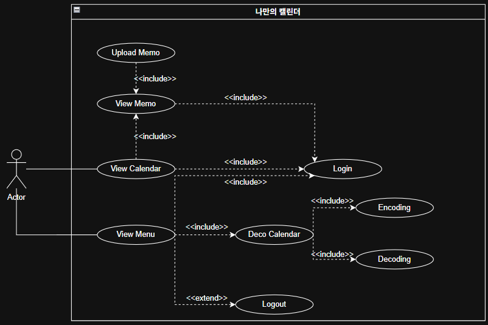
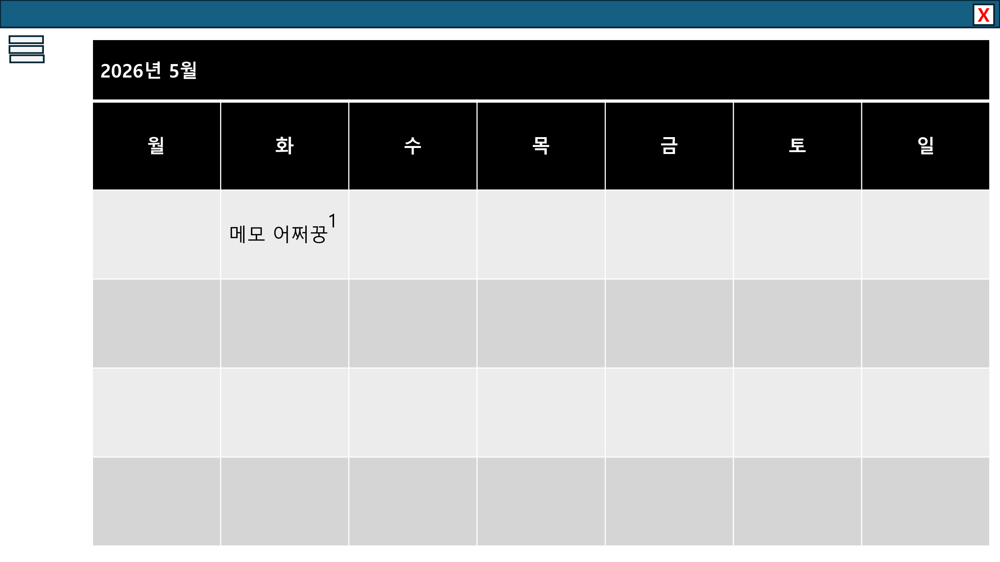
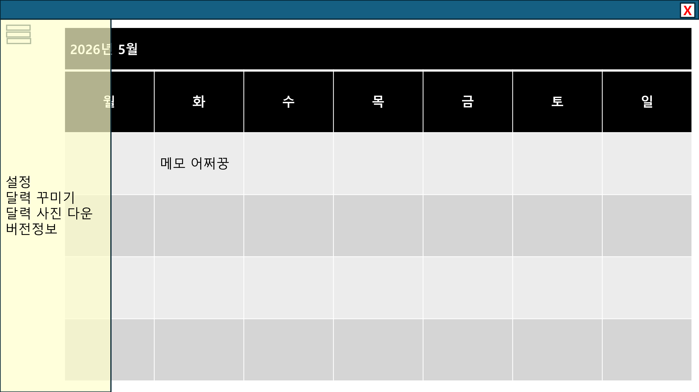
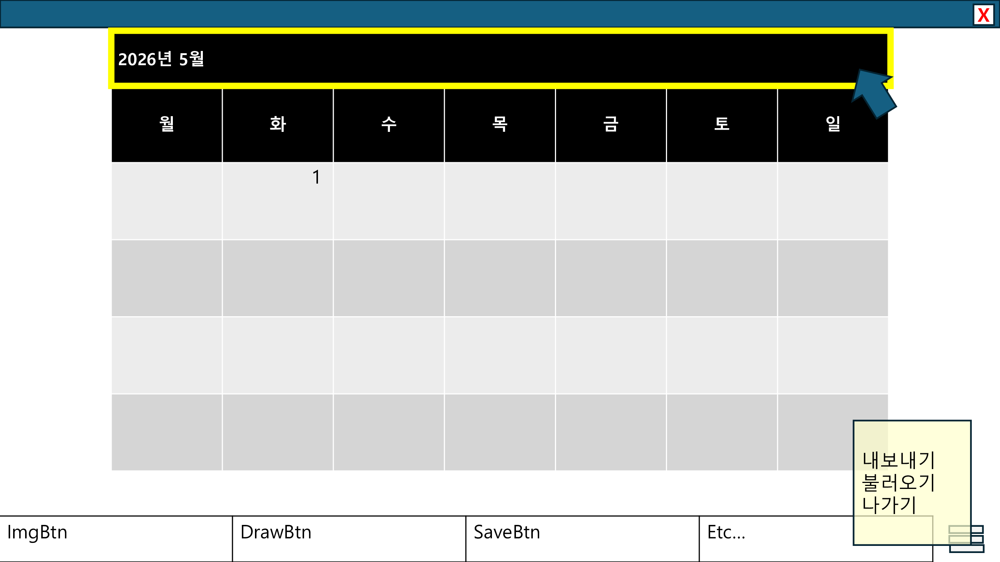
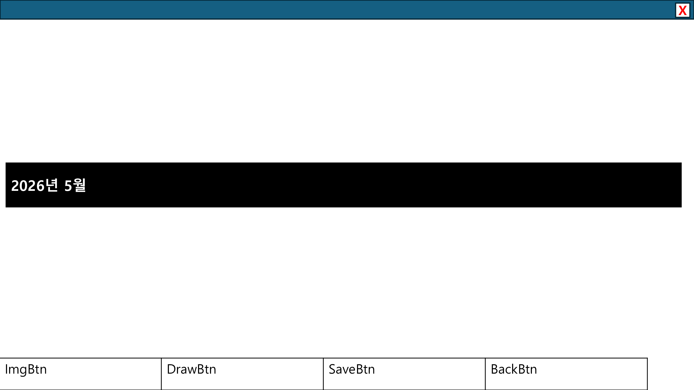
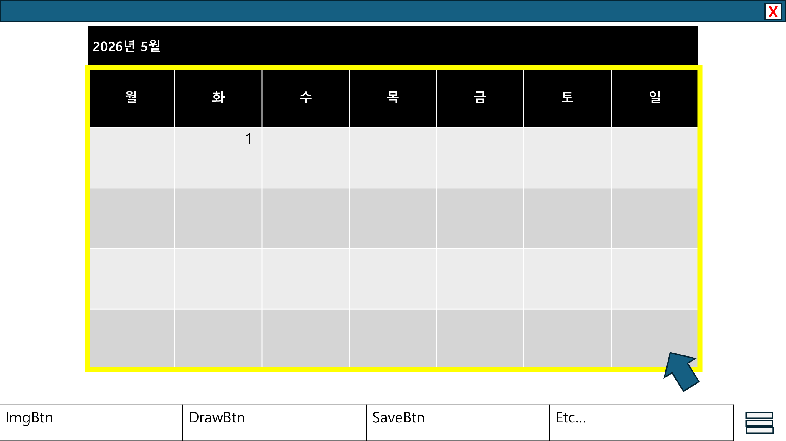
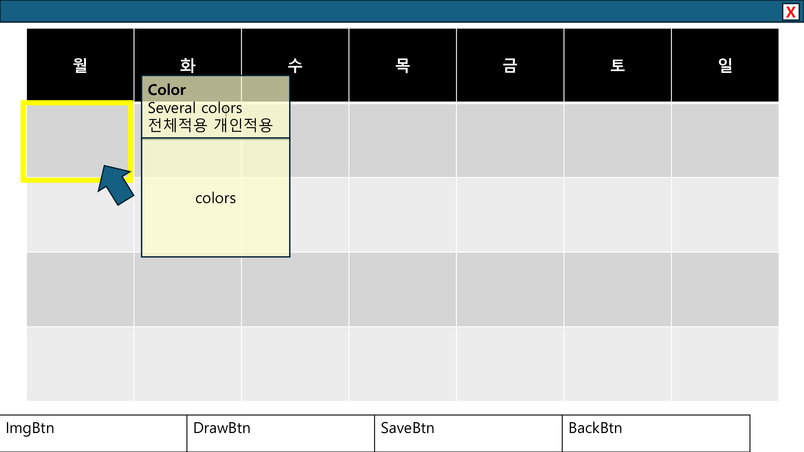
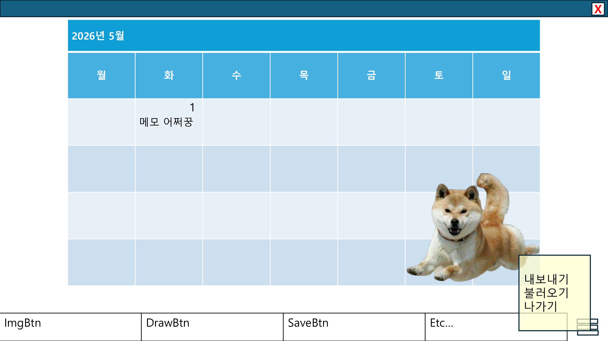
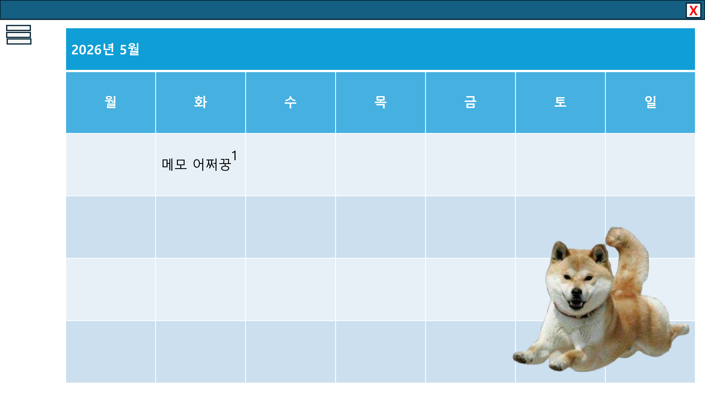

<h1 align="center">
  나만의 캘린더 
  -Analysis document-  
     
</h1>
<body style="font-size: 20px;">22412073, 이아림, forleer179@gmail.comm</body>

<h2 align="center">[ Revision history ]</h2>

<table>
  <tr>
    <th>Revision date</th>
    <th>Version #</th>
    <th>Description</th>
    <th>Author</th>
  </tr>
  <tr>
    <th>2026-05-01</th>
    <th>#0.1</th>
    <th>First Documentation</th>
    <th></th>
  </tr>
  <tr>
    <th>2026-05-26</th>
    <th>#0.2</th>
    <th>Update analysis based on implemented pretyCalendar files</th>
    <th></th>
  </tr>
</table>

<h2 align="center">= Contents =</h2>
<h3>
  1. Introduction 
  2. Use case analysis 
  2.1 Use case diagram 
  2.2 Use case description 
  3. Domain analysis 
  4. Application analysis 
  4.1 Application analysis 
  4.2 Communication diagram 
  5. User Interface prototype 
  6. Glossary 
  7. References 
</h3>

<h2>1. Introduction</h2>
나만의 캘린더는 사용자가 월별 캘린더를 확인하고 날짜별 메모를 작성하며, 캘린더의 폰트와 색상, 배경을 직접 꾸밀 수 있도록 만든 웹 기반 캘린더 시스템이다. 본 프로젝트는 index.html, renderer.js, style.css로 구성된 기본 캘린더 화면과 decorate.html, decorate.js, decorate.css로 구성된 캘린더 꾸미기 화면을 중심으로 동작한다. 기본 화면에서는 공공데이터포털 공휴일 API를 이용해 공휴일을 표시하고, 사용자가 날짜를 클릭하면 메모 모달을 열어 내용을 저장하거나 삭제할 수 있다. 꾸미기 화면에서는 폰트 종류, 폰트 크기, 평일/토요일/일요일 글자 색상, 전체 배경, 날짜 칸 색상, 이전 달/다음 달 칸 투명도, 하이라이트 색상 등을 미리보기로 확인하고 저장할 수 있다. 이번 보고서는 실제 구현된 시스템의 요구사항을 바탕으로 use case, domain, application 분석과 사용자 인터페이스를 정리한다.
<h2>2. Use case analysis</h2>
<h3>2.1 Use case diagram</h3>
 
<h3>2.2 Use case description</h3>
<table>
  <tr>
    <th colspan="2">Use case #1: View Calendar</th>
  </tr>
  <tr>
    <th colspan="2">GENERAL CHARACTERISTICS</th>
  </tr>
  <tr>
    <th>Summary</th>
    <td>사용자가 현재 월의 캘린더, 요일, 날짜, 오늘 표시, 공휴일 정보를 확인하는 기능</td>
  </tr>
  <tr>
    <th>Scope</th>
    <td>캘린더 꾸미기</td>
  </tr>
  <tr>
    <th>Level</th>
    <td>User level</td>
  </tr>
  <tr>
    <th>Author</th>
    <td></td>
  </tr>
  <tr>
    <th>Last Update</th>
    <td>2026-05-26</td>
  </tr>
  <tr>
    <th>Status</th>
    <td>Analysis</td>
  </tr>
  <tr>
    <th>Primary Actor</th>
    <td>User</td>
  </tr>
  <tr>
    <th>Preconditions</th>
    <td>사용자는 index.html을 실행할 수 있어야 한다. 공휴일 정보 표시를 위해 인터넷 연결이 가능하면 좋다.</td>
  </tr>
  <tr>
    <th>Trigger</th>
    <td>사용자가 캘린더 페이지를 열었을 때</td>
  </tr>
  <tr>
    <th>Success Post Condition</th>
    <td>현재 월의 날짜 칸과 요일, 오늘 날짜, 공휴일, 저장된 메모 미리보기가 화면에 표시된다.</td>
  </tr>
  <tr>
    <th>Failed Post Condition</th>
    <td>공휴일 API 호출에 실패해도 캘린더는 표시되며, 공휴일 정보만 표시되지 않을 수 있다.</td>
  </tr>
  <tr>
    <th colspan="2">MAIN SUCCESS SCENARIO</th>
  </tr>
  <tr>
    <th>Step</th>
    <td>Action</td>
  </tr>
  <tr>
    <th>1</th> <td>이 Use case는 사용자가 캘린더 페이지를 열 때 시작된다.</td>
  </tr>
  <tr>
    <th>2</th> <td>시스템은 현재 날짜를 기준으로 연도와 월을 계산한다.</td>
  </tr>
  <tr>
    <th>3</th> <td>시스템은 공공데이터포털 API에서 해당 연도의 공휴일 정보를 불러오고 연도별 캐시에 저장한다.</td>
  </tr>
  <tr>
    <th>4</th> <td>시스템은 localStorage에 저장된 메모를 읽어 날짜별 미리보기와 함께 캘린더를 렌더링한다.</td>
  </tr>
  <tr>
    <th>5</th> <td>이 use case는 캘린더가 화면에 표시되면 끝난다.</td>
  </tr>
  <tr>
    <th colspan="2">EXTENSION SCENARIO</th>
  </tr>
  <tr>
    <th>Step</th> <td>Branching Action</td>
  </tr>
  <tr>
    <th>3</th> <td>3a. 공휴일 API 호출에 실패한다. 3a1. 시스템은 콘솔에 오류를 기록한다. 3a2. 공휴일 정보 없이 캘린더를 계속 렌더링한다.</td>
  </tr>
  <tr>
    <th colspan="2">RELATED INFORMATION</th>
  </tr>
  <tr>
    <th>Performance</th> <td>< 1 second</td>
  </tr>
  <tr>
    <th>Frequency</th> <td>사용자당 하루 평균 1번 이상</td>
  </tr>
  <tr>
    <th>Concurrency</th> <td>No Limits</td>
  </tr>
  <th>Due Date</th> <td></td>
</table>

<table>
  <tr>
    <th colspan="2">Use case #2: Change Month</th>
  </tr>
  <tr>
    <th colspan="2">GENERAL CHARACTERISTICS</th>
  </tr>
  <tr>
    <th>Summary</th> <td>사용자가 이전 달 또는 다음 달 캘린더로 이동하는 기능</td>
  </tr>
  <tr>
    <th>Scope</th> <td>캘린더 꾸미기</td>
  </tr>
  <tr>
    <th>Level</th> <td>User level</td>
  </tr>
  <tr>
    <th>Author</th> <td></td>
  </tr>
  <tr>
    <th>Last Update</th> <td>2026-05-26</td>
  </tr>
  <tr>
    <th>Status</th> <td>Analysis</td>
  </tr>
  <tr>
    <th>Primary Actor</th> <td>User</td>
  </tr>
  <tr>
    <th>Preconditions</th> <td>캘린더 화면이 정상적으로 표시되어 있어야 한다.</td>
  </tr>
  <tr>
    <th>Trigger</th> <td>사용자가 이전 달 또는 다음 달 버튼을 클릭할 때</td>
  </tr>
  <tr>
    <th>Success Post Condition</th> <td>선택한 월의 캘린더가 다시 표시된다.</td>
  </tr>
  <tr>
    <th>Failed Post Condition</th> <td>월 이동에 실패하면 기존 캘린더 화면이 유지된다.</td>
  </tr>
  <tr>
    <th colspan="2">MAIN SUCCESS SCENARIO</th>
  </tr>
  <tr>
    <th>Step</th> <td>Action</td>
  </tr>
  <tr>
    <th>1</th> <td>이 Use case는 사용자가 월 이동 버튼을 누를 때 시작된다.</td>
  </tr>
  <tr>
    <th>2</th> <td>사용자는 왼쪽 버튼을 눌러 이전 달로 이동하거나 오른쪽 버튼을 눌러 다음 달로 이동한다.</td>
  </tr>
  <tr>
    <th>3</th> <td>시스템은 내부 date 값을 변경하고 makeCalendar 함수를 다시 실행한다.</td>
  </tr>
  <tr>
    <th>4</th> <td>이 use case는 변경된 월의 캘린더가 표시되면 끝난다.</td>
  </tr>
  <tr>
    <th colspan="2">EXTENSION SCENARIO</th>
  </tr>
  <tr>
    <th>Step</th> <td>Branching Action</td>
  </tr>
  <tr>
    <th>3</th> <td>3a. 공휴일 정보를 불러오지 못한다. 3a1. 시스템은 공휴일 정보를 제외하고 해당 월을 표시한다. 3a2. 사용자는 계속 월 이동 기능을 사용할 수 있다.</td>
  </tr>
  <tr>
    <th colspan="2">RELATED INFORMATION</th>
  </tr>
  <tr>
    <th>Performance</th> <td>< 1 second</td>
  </tr>
  <tr>
    <th>Frequency</th> <td>사용자당 하루 평균 3번</td>
  </tr>
  <tr>
    <th>Concurrency</th> <td>No Limits</td>
  </tr>
  <th>Due Date</th> <td></td>
</table>

<table>
  <tr>
    <th colspan="2">Use case #3: Manage Memo</th>
  </tr>
  <tr>
    <th colspan="2">GENERAL CHARACTERISTICS</th>
  </tr>
  <tr>
    <th>Summary</th> <td>사용자가 특정 날짜의 메모를 확인, 저장, 삭제하는 기능</td>
  </tr>
  <tr>
    <th>Scope</th> <td>캘린더 꾸미기</td>
  </tr>
  <tr>
    <th>Level</th> <td>User level</td>
  </tr>
  <tr>
    <th>Author</th> <td></td>
  </tr>
  <tr>
    <th>Last Update</th> <td>2026-05-26</td>
  </tr>
  <tr>
    <th>Status</th> <td>Analysis</td>
  </tr>
  <tr>
    <th>Primary Actor</th> <td>User</td>
  </tr>
  <tr>
    <th>Preconditions</th> <td>캘린더가 화면에 표시되어 있어야 한다.</td>
  </tr>
  <tr>
    <th>Trigger</th> <td>사용자가 캘린더의 날짜 칸을 클릭할 때</td>
  </tr>
  <tr>
    <th>Success Post Condition</th> <td>선택한 날짜의 메모가 localStorage에 저장되거나 삭제되고 캘린더에 반영된다.</td>
  </tr>
  <tr>
    <th>Failed Post Condition</th> <td>선택된 날짜 정보가 없으면 저장 또는 삭제가 수행되지 않는다.</td>
  </tr>
  <tr>
    <th colspan="2">MAIN SUCCESS SCENARIO</th>
  </tr>
  <tr>
    <th>Step</th> <td>Action</td>
  </tr>
  <tr>
    <th>1</th> <td>이 Use case는 사용자가 특정 날짜 칸을 클릭할 때 시작된다.</td>
  </tr>
  <tr>
    <th>2</th> <td>시스템은 선택된 날짜 키와 공휴일 정보를 모달에 전달한다.</td>
  </tr>
  <tr>
    <th>3</th> <td>시스템은 localStorage에서 해당 날짜의 기존 메모를 읽어 textarea에 표시한다.</td>
  </tr>
  <tr>
    <th>4</th> <td>사용자는 메모를 작성한 뒤 저장 버튼을 누른다.</td>
  </tr>
  <tr>
    <th>5</th> <td>시스템은 calendarMemos 값에 메모를 저장하고 모달을 닫은 뒤 캘린더를 다시 렌더링한다.</td>
  </tr>
  <tr>
    <th>6</th> <td>이 use case는 메모 미리보기가 캘린더에 반영되면 종료된다.</td>
  </tr>
  <tr>
    <th colspan="2">EXTENSION SCENARIO</th>
  </tr>
  <tr>
    <th>Step</th> <td>Branching Action</td>
  </tr>
  <tr>
    <th>4</th> <td>4a. 사용자가 삭제 버튼을 누른다. 4a1. 시스템은 선택 날짜의 메모를 localStorage에서 삭제한다. 4a2. 모달을 닫고 캘린더를 다시 렌더링한다.</td>
  </tr>
  <tr>
    <th>4</th> <td>4b. 사용자가 닫기 버튼 또는 모달 바깥 영역을 누른다. 4b1. 시스템은 값을 변경하지 않고 모달을 닫는다.</td>
  </tr>
  <tr>
    <th colspan="2">RELATED INFORMATION</th>
  </tr>
  <tr>
    <th>Performance</th> <td>< 1 second</td>
  </tr>
  <tr>
    <th>Frequency</th> <td>사용자당 하루 평균 1번</td>
  </tr>
  <tr>
    <th>Concurrency</th> <td>No Limits</td>
  </tr>
  <th>Due Date</th> <td></td>
</table>

<table>
  <tr>
    <th colspan="2">Use case #4: Open Side Menu</th>
  </tr>
  <tr>
    <th colspan="2">GENERAL CHARACTERISTICS</th>
  </tr>
  <tr>
    <th>Summary</th> <td>사용자가 옵션 아이콘을 눌러 사이드 메뉴를 열고 꾸미기 페이지로 이동하는 기능</td>
  </tr>
  <tr>
    <th>Scope</th> <td>캘린더 꾸미기</td>
  </tr>
  <tr>
    <th>Level</th> <td>User level</td>
  </tr>
  <tr>
    <th>Author</th> <td></td>
  </tr>
  <tr>
    <th>Last Update</th> <td>2026-05-26</td>
  </tr>
  <tr>
    <th>Status</th> <td>Analysis</td>
  </tr>
  <tr>
    <th>Primary Actor</th> <td>User</td>
  </tr>
  <tr>
    <th>Preconditions</th> <td>캘린더 화면의 optionIcon.png 아이콘이 표시되어 있어야 한다.</td>
  </tr>
  <tr>
    <th>Trigger</th> <td>사용자가 왼쪽 상단 옵션 아이콘을 클릭할 때</td>
  </tr>
  <tr>
    <th>Success Post Condition</th> <td>사이드바가 열리고 사용자는 캘린더 꾸미기 메뉴를 선택할 수 있다.</td>
  </tr>
  <tr>
    <th>Failed Post Condition</th> <td>사이드바가 열리지 않으면 사용자는 현재 캘린더 화면에 머무른다.</td>
  </tr>
  <tr>
    <th colspan="2">MAIN SUCCESS SCENARIO</th>
  </tr>
  <tr>
    <th>Step</th> <td>Action</td>
  </tr>
  <tr>
    <th>1</th> <td>이 Use case는 사용자가 옵션 아이콘을 클릭할 때 시작된다.</td>
  </tr>
  <tr>
    <th>2</th> <td>시스템은 사이드바에 open 클래스를 추가하고 오버레이를 활성화한다.</td>
  </tr>
  <tr>
    <th>3</th> <td>사용자는 메뉴의 캘린더 꾸미기 항목을 클릭한다.</td>
  </tr>
  <tr>
    <th>4</th> <td>시스템은 decorate.html 페이지로 이동한다.</td>
  </tr>
  <tr>
    <th colspan="2">EXTENSION SCENARIO</th>
  </tr>
  <tr>
    <th>Step</th> <td>Branching Action</td>
  </tr>
  <tr>
    <th>2</th> <td>2a. 사이드바가 열린 상태에서 사용자가 아이콘을 다시 누른다. 2a1. 시스템은 사이드바를 닫는다.</td>
  </tr>
  <tr>
    <th>2</th> <td>2b. 사용자가 오버레이 영역을 클릭한다. 2b1. 시스템은 사이드바를 닫는다.</td>
  </tr>
  <tr>
    <th colspan="2">RELATED INFORMATION</th>
  </tr>
  <tr>
    <th>Performance</th> <td>< 1 second</td>
  </tr>
  <tr>
    <th>Frequency</th> <td>사용자당 하루 평균 1번</td>
  </tr>
  <tr>
    <th>Concurrency</th> <td>No Limits</td>
  </tr>
  <th>Due Date</th> <td></td>
</table>

<table>
  <tr>
    <th colspan="2">Use case #5: Deco Calendar</th>
  </tr>
  <tr>
    <th colspan="2">GENERAL CHARACTERISTICS</th>
  </tr>
  <tr>
    <th>Summary</th> <td>사용자가 캘린더의 폰트, 색상, 배경, 날짜 칸 스타일을 꾸미고 저장하는 기능</td>
  </tr>
  <tr>
    <th>Scope</th> <td>캘린더 꾸미기</td>
  </tr>
  <tr>
    <th>Level</th> <td>User level</td>
  </tr>
  <tr>
    <th>Author</th> <td></td>
  </tr>
  <tr>
    <th>Last Update</th> <td>2026-05-26</td>
  </tr>
  <tr>
    <th>Status</th> <td>Analysis</td>
  </tr>
  <tr>
    <th>Primary Actor</th> <td>User</td>
  </tr>
  <tr>
    <th>Preconditions</th> <td>사용자는 decorate.html 페이지에 접근할 수 있어야 한다.</td>
  </tr>
  <tr>
    <th>Trigger</th> <td>사용자가 캘린더 꾸미기 메뉴를 선택했을 때</td>
  </tr>
  <tr>
    <th>Success Post Condition</th> <td>사용자가 선택한 꾸미기 값이 미리보기에 적용되고 localStorage에 저장된다.</td>
  </tr>
  <tr>
    <th>Failed Post Condition</th> <td>저장하지 않고 나가면 이전 저장값이 유지된다.</td>
  </tr>
  <tr>
    <th colspan="2">MAIN SUCCESS SCENARIO</th>
  </tr>
  <tr>
    <th>Step</th> <td>Action</td>
  </tr>
  <tr>
    <th>1</th> <td>이 Use case는 사용자가 캘린더 꾸미기 페이지에 들어갈 때 시작된다.</td>
  </tr>
  <tr>
    <th>2</th> <td>시스템은 미리보기 캘린더와 꾸미기 요소 사이드바를 표시한다.</td>
  </tr>
  <tr>
    <th>3</th> <td>사용자는 폰트 종류, 폰트 크기, 평일/토요일/일요일 색상, 배경 색상, 기본 칸 색상, 이전 달/다음 달 칸 색상과 투명도, 하이라이트 색상과 투명도를 변경한다.</td>
  </tr>
  <tr>
    <th>4</th> <td>시스템은 변경 값을 즉시 미리보기 캘린더에 반영한다.</td>
  </tr>
  <tr>
    <th>5</th> <td>사용자는 저장 버튼을 누른다.</td>
  </tr>
  <tr>
    <th>6</th> <td>시스템은 꾸미기 정보를 localStorage에 저장하고 저장 완료 메시지를 보여준다.</td>
  </tr>
  <tr>
    <th colspan="2">EXTENSION SCENARIO</th>
  </tr>
  <tr>
    <th>Step</th> <td>Branching Action</td>
  </tr>
  <tr>
    <th>3</th> <td>3a. 사용자가 초기화 버튼을 누른다. 3a1. 시스템은 해당 항목을 기본값으로 되돌린다.</td>
  </tr>
  <tr>
      <th>3</th> <td>3b. 사용자가 흰색 또는 검정 테마 버튼을 누른다. 3b1. 시스템은 선택한 테마 값을 배경, 날짜 칸, 글자 색상에 적용한다.</td>
  <tr>
    <th>5</th> <td>5a. 사용자가 나가기 버튼을 누른다. 5a1. 시스템은 index.html로 이동한다.</td>
  </tr>
  <tr>
    <th colspan="2">RELATED INFORMATION</th>
  </tr>
  <tr>
    <th>Performance</th> <td>< 1 second</td>
  </tr>
  <tr>
    <th>Frequency</th> <td>사용자당 하루 평균 1번</td>
  </tr>
  <tr>
    <th>Concurrency</th> <td>No Limits</td>
  </tr>
  <th>Due Date</th> <td></td>
</table>

<h2>3. Domain analysis</h2>
1) Calendar_d 
캘린더 클래스다. 현재 연도와 월, 시작 요일, 마지막 날짜, 오늘 날짜를 계산하고 날짜 칸을 구성하는 데 필요한 데이터를 가진다. 
2) Holiday_d 
공휴일 클래스다. 공공데이터포털 API에서 받아온 공휴일 날짜와 공휴일명을 저장하고, 연도별 캐시를 통해 같은 데이터를 반복 호출하지 않도록 관리한다. 
3) Memo_d 
메모 클래스다. 사용자가 날짜별로 입력한 메모 내용을 YYYY-MM-DD 형식의 날짜 키와 함께 localStorage에 저장한다. 
4)  Cal_Deco_d 
캘린더의 꾸미기 정보를 저장하는 클래스다. 폰트, 폰트 크기, 글자 색상, 배경 색상, 날짜 칸 색상, 투명도, 하이라이트 정보를 가진다. 
5) Side_Menu_d 
사이드 메뉴 클래스다. 옵션 아이콘 클릭 여부에 따라 메뉴와 오버레이를 열고 닫으며, 캘린더 꾸미기 페이지로 이동하는 기능을 가진다.

<h2>4. User Interface prototype</h2>
<h4>1. Calendar Screen</h4>
 
사용자가 index.html을 실행하면 현재 월 캘린더가 표시된다. 상단에는 이전 달, 현재 연월, 다음 달 버튼이 있고, 날짜 칸에는 오늘 날짜, 토요일, 일요일, 공휴일, 메모 미리보기가 구분되어 나타난다.
<h4>2. Side Menu Screen</h4>
 
사용자가 왼쪽 상단 옵션 아이콘을 클릭하면 사이드바 메뉴가 열린다. 메뉴에는 캘린더 꾸미기 항목이 있고, 이를 클릭하면 decorate.html 화면으로 이동한다.
<h4>3. Deco Calendar Screen</h4>
 
 
 
 
 
캘린더 꾸미기 화면은 왼쪽 미리보기 캘린더와 오른쪽 꾸미기 사이드바로 구성된다. 사용자는 폰트 종류, 폰트 사이즈, 평일/토요일/일요일 글자 색상, 전체 배경, 기본 칸, 이전 달/다음 달 칸, 하이라이트 표시를 조절할 수 있다.
<h4>4. Calendar Background</h4>
 
저장된 꾸미기 설정은 localStorage에 보관된다. 사용자가 다시 꾸미기 화면을 열면 이전에 저장한 폰트와 색상 값이 불러와져 같은 상태로 편집을 이어갈 수 있다.
<h2>5. Glossary</h2>
<table>
  <tr>
    <th>Term</th>
    <th>Description</th>
  </tr>
  <tr>
    <th>캘린더 꾸미기</th>
    <td>캘린더의 폰트, 색상, 배경, 날짜 칸 스타일을 사용자가 직접 설정할 수 있도록 제공하는 기능</td>
  </tr>
  <tr>
    <th>사용자</th>
    <td>캘린더를 확인하고 메모를 작성하며 꾸미기 기능을 이용하는 사람</td>
  </tr>
  <tr>
    <th>캘린더</th>
    <td>월별 날짜, 요일, 오늘 표시, 공휴일, 메모 미리보기를 보여주는 화면</td>
  </tr>
  <tr>
    <th>localStorage</th>
    <td>브라우저에 메모와 꾸미기 설정을 저장하기 위한 로컬 저장소</td>
  </tr>
  <tr>
    <th>공휴일 API</th>
    <td>공공데이터포털에서 연도별 공휴일 정보를 받아오기 위한 외부 API</td>
  </tr>
</table>

<h2>6. References</h2>
1) C:\2026_1\pretyCalendar\index.html 
2) C:\2026_1\pretyCalendar\renderer.js 
3) C:\2026_1\pretyCalendar\style.css 
4) C:\2026_1\pretyCalendar\decorate.html 
5) C:\2026_1\pretyCalendar\decorate.js 
6) C:\2026_1\pretyCalendar\decorate.css 
